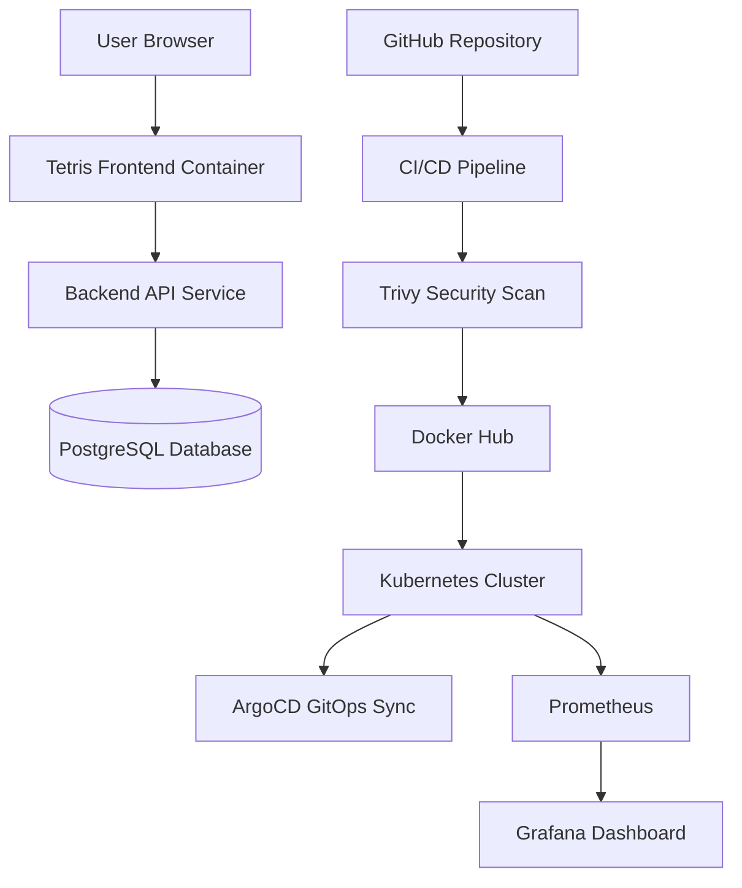

# 🎮 Tetris DevOps Platform


#  Three-Tier Cloud-Native DevOps Project

A complete cloud-native DevOps portfolio project built around a Tetris application using Docker, CI/CD, Kubernetes, GitOps, DevSecOps, Monitoring, and Observability practices.

---

# 📸 Project Architecture



---

# 🧰 Tech Stack

| Category | Tools |
|---|---|
| Frontend | Tetris Docker Image |
| Backend | Flask / Node.js |
| Database | PostgreSQL |
| Containerization | Docker, Docker Compose |
| CI/CD | GitHub Actions / Jenkins |
| Security | Trivy, kube-score |
| Orchestration | Kubernetes |
| GitOps | ArgoCD |
| Monitoring | Prometheus, Grafana |

---

# 📁 Project Structure

```text
tetris-devops-platform/
│
├── backend/
├── k8s/
├── .github/
├── docker-compose.yml
└── README.md
```

---

# 🐳 Docker Workflow

## Pull Frontend Image

```bash
docker pull bsord/tetris
```

## Run Frontend

```bash
docker run -d -p 8080:80 bsord/tetris
```

---

# ⚙️ Docker Compose

```bash
docker compose up -d
docker compose ps
docker compose logs -f
docker compose down
```

---

# 🔄 CI/CD Pipeline

Pipeline Stages:

- Checkout source code
- Install dependencies
- Run tests
- Build Docker images
- Security scanning with Trivy
- Push images to Docker Hub
- Update Kubernetes manifests

---

# 🔐 DevSecOps

## Trivy Scan

```bash
trivy image YOUR_DOCKERHUB_USERNAME/tetris-backend:latest
```

---

# ☸️ Kubernetes Deployment

```bash
kubectl apply -f k8s/base/
```

## Check Pods

```bash
kubectl get pods -n tetris
```

## Check Services

```bash
kubectl get svc -n tetris
```

---

# 🔁 GitOps with ArgoCD

```bash
kubectl apply -f k8s/argocd/
```

---

# 📊 Monitoring

Monitoring stack includes:

- Prometheus
- Grafana
- Node Exporter
- kube-state-metrics

---

# 📈 Grafana Access

```bash
kubectl port-forward svc/monitoring-grafana -n monitoring 3000:80
```

Open:

```text
http://localhost:3000
```

---

# 🧠 Key DevOps Concepts

- Docker containerization
- CI/CD automation
- Kubernetes orchestration
- GitOps workflow
- DevSecOps scanning
- Monitoring and observability

---

# 👤 Author

## Abin Nazer

DevOps | Cloud | Kubernetes Enthusiast
